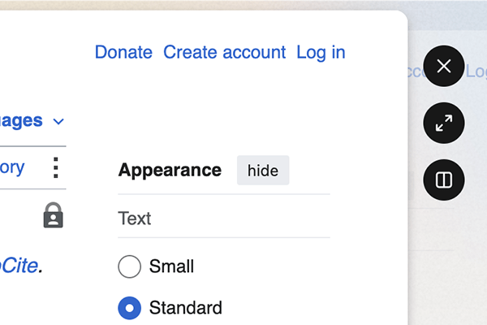

# Glance Button Colors

Customize Zen Browser's floating Glance button colors.



Glance Button Colors lets you customize Zen Browser's floating Glance controls.

Zen's workspace theme colors can sometimes make the Glance buttons difficult to read. This mod lets you set your own icon color, button background, hover background, opacity, border, and shadow.

## Options

- Icon color
- Button background
- Hover background
- Button opacity
- Button border
- Button shadow

## Defaults

- White icons
- Dark button background
- Slightly lighter hover background
- No border
- No shadow
- Full opacity

## Notes

This mod targets Zen's floating Glance controls using:

```css
.zen-glance-sidebar-container
